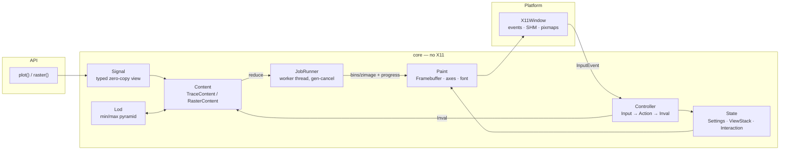

# signal_sniper_plot: evaluation and proposed architecture

Status: proposal · Scope: xplot (1-D) and xraster (2-D) · Reference: `../sigplot` (SigPlot, JS)

---

## 0. Summary

- **The current code can't scale because of how it stores data, not how it renders.** Every sample becomes a
  24-byte `PlotSample {time, real, imag}`, and the data is copied twice. The 3-trace test (25 M complex-float
  samples, 200 MB of input) holds about **1.2 GB** while it runs. Precision is also lost: `double`→`float`,
  and `int32/64`→`float`.
- **SigPlot isn't fast either.** Its 1-D path draws every point with no decimation. By default it caps each
  layer at 32 768 points (`bufmax`) unless you turn on "ALL" mode. Take its **UI model and state model** from it.
  Don't take its rendering pipeline.
- **The proposal is one engine that serves both xplot and xraster.** It has four layers:
  `Signal` (a zero-copy typed view of the data) → `Reduce` (expensive work, done on a worker thread, cancellable,
  cached per view) → `Paint` (cheap, O(pixels)) → `Present` (X11).
  1-D gets a min/max **level-of-detail pyramid**. After the first pass, any view of any size renders in about 1 ms.
- **Progressive rendering and interruption fall out of this design.** The worker fills per-column (1-D) or
  per-row (2-D) results left to right, and the UI thread paints whatever is done at 30–60 Hz. Any mouse press stops
  the job, and a drag in the same gesture zooms. Work that already finished (pyramid blocks) is kept.
- **The API stays small.** `plot(signals, opts)` and `raster(signal, opts)` in C++;
  `ssp.plot(x, ...)` and `ssp.raster(x2d, ...)` in Python. Any numpy dtype works, including `np.memmap`, so files
  larger than RAM can be plotted without a copy.
- **xraster cuts reuse xplot.** An x-cut or y-cut is just a `Signal` view (contiguous or strided) of the raster's
  memory. It is pushed as a new xplot screen on the same window, and Esc pops back to the raster, which is still cached.
- **Size estimate:** about 3 000 lines of C++ for full xplot and xraster, compared with about 1 500 lines today
  (fewer features) and about 23 000 lines in SigPlot.

---

## 1. Current UI inventory (main @ 10ce462)

| Area | What exists |
|---|---|
| Window | 1000×600, minimum 400×300, resizable, black plot area. The window background is **white**, so it flashes white on resize and expose. No window title is set (`XStoreName` is never called). |
| Toolbar (bottom row) | Save PNG (actually writes **`plot_out.ppm`**), Cycle X-Axis (TIME↔INDEX: labels only), Magnitude, Real, Imag, Phase, "Imag vs Real" (IQ scatter). Switching into or out of IQ resets zoom. |
| Legend row | A swatch and label per trace. LMB toggles visibility (show is additive, hide triggers a full redraw). RMB toggles LINES↔DOTS. |
| Plot area mouse | LMB drag draws a zoom box (> 3 px, **max 5 levels**). RMB unzooms one level. MMB pauses or resumes streaming. Wheel does nothing. |
| Keyboard | None. |
| Overlays | Dotted crosshair. Readout reads `Mode: X  Time: t  Value: v`. |
| Axes | Fixed 5 divisions with `%.2f` labels. No grid, no axis units or labels. The title is centred using a guessed width. |
| Rendering | Per-trace column streaming at 50 columns per loop, with a per-trace min/max bin cache per view. Traces render one after another. |
| API | C++ `plot_buffer(raw, n, elem_bytes, is_complex, is_float, …)` and `plot_buffer_traces(vector<Trace>, …)`. Python has a single `plot_buffer(data, xstart, xdelta, plot_title, line_thickness, y_range, x_range, num_traces)`. |

### Defects found (verified by reading the code)

| # | Defect | Location |
|---|---|---|
| 1 | **Phase is wrong.** It computes `atan2(real, imag)`; it should be `atan2(imag, real)`. | `plot_session.cc:58` |
| 2 | **Autoscale only looks at trace 0.** Other traces can be clipped in both x and y. | `run()`, `reset_zoom()` |
| 3 | IQ mode ignores `visible`. Showing a trace from the legend while in IQ mode streams a *time-domain* trace on top of the IQ scatter (`compute_value(IQ)` falls through and returns `real`). | `render_pixmap_init`, legend handler |
| 4 | IQ mode calls `XFillArc` once per sample, synchronously, with no streaming. At 1e7 points the window freezes. | `render_pixmap_init` |
| 5 | The readout uses `precision(2)`, so it shows 2 **significant** digits (`Time: 1.2e+02`). Tick labels are `%.2f`, so every label reads `0.00` when xdelta is 1e-6. | event loop, `draw_axes` |
| 6 | The idle loop busy-polls every 10 ms and does a full-window `XCopyArea` each time. Idle CPU use never reaches zero. | `run()` |
| 7 | `exit(1)` is called when there is no display, which **kills the host Python process**. | `init_x11` |
| 8 | Python: `uint16` goes down the `int16` path (sign bug), `int8`/`uint8` throw, and `num_traces` splits the data into contiguous blocks even though the docstring says "interleaved". Any leftover samples are silently dropped. | `module.cc` |
| 9 | Python: the GIL is held for the entire blocking event loop. Ctrl-C and other threads are dead until the window closes. | `module.cc` |
| 10 | INDEX mode reads `traces_[0].samples[1]` without checking the size, and it uses trace 0's `dt` for every trace. | `draw_axes`, motion handler |
| 11 | `XQueryFont` is called on every y tick. Each call is a server round trip, which is slow over `ssh -X`. | `draw_axes` |
| 12 | Every redraw resets the MMB "pause" (`render_pixmap_init` clears `stream_paused_`). | `render_pixmap_init` |
| 13 | Column connectors join the *previous column's max* to the *current column's min*, not last sample to first sample, which leaves visual artifacts on steep edges. | `render_stream_columns` |
| 14 | `set_zoom_range()` is dead code because `run()` overwrites the view. | `run()` |

Branch `ajh/adding_ir_plot` is superseded; main already contains IQ mode.

### Why this doesn't scale to large N

1. **Data model.** 24 B per sample, time stored explicitly, at least 2 copies, float precision loss. The
   input can't be memory-mapped, so data larger than RAM is impossible.
2. **No level of detail.** Every change of view or mode rescans the samples in view. At 1e9 samples each zoom-out is
   a full scan, and it runs on the UI thread.
3. **The render loop and the UI share one thread.** Work is time-sliced as "50 columns per iteration". For a column
   that covers 1e7 samples, or any page fault on a memory-mapped file, that one slice blocks input.
4. **Rendering is tied to X.** State, input handling, and drawing all live in one 925-line class. It can't be tested
   headless and it can't be reused for rasters.

---

## 2. The reference UI: xplot and xraster as SigPlot implements them

### 2.1 Interaction model (`sigplot.js`)

**Mouse**
| Input | Action |
|---|---|
| LM drag | Rubber-band zoom. Mode is box, horizontal, or vertical (cycled with `B`). Can also be set to "select" (emits an `mtag` with the box). |
| LM click | Sets the **marker** (`xmrk`/`ymrk`). The readout then shows `dx`/`dy` relative to it. Emits `mtag`. |
| RM click | Unzooms one level. |
| MM | Main menu. |
| Wheel | Over a pan bar it pans. Over the plot it zooms (optional, `wheelZoom`). |
| Pan bars | An x bar on top and a y bar on the right. Drag the thumb, click beside it to page, click the centre region to re-centre. |

**Keys** (active only while the mouse is over the plot)
| Key | Action |
|---|---|
| `?` | Help |
| `A` | Cycle the readout abscissa: absc → index → 1/absc → dy/dx |
| `B` | Cycle drag mode: box → horizontal → vertical |
| `C` | Toggle controls (mtag on LM click) |
| `G` / `L` / `R` / `S` | Grid / legend / readout / specs (axes and readout) |
| `K` | Show marker |
| `X` / `Y` | 1-D: pop up the x or y value. **2-D: x-cut or y-cut at the mouse (press again to leave).** |
| `P` | 2-D: p-cuts (live side and bottom cut panels that follow the mouse) |
| `Z` | Show z at the mouse |
| `T` | Timecode at the mouse |
| `M` | Menu |
| `F` | Fullscreen |
| Ctrl-I | Invert colours |

**Main menu (MMB):** CX Mode (Ma, Ph, Re, Im, IR, 10log, 20log) · Scaling (X/Y/Z: typed min/max, Min/Max/Full
auto) · Grid · Settings (All mode, mouse modes, crosshair on/off/h/v, index, legend, pan bars, phase units rad/deg/cycles,
specs, p-cuts, colourbar, x/y divisions, labels, y inversion, invert colours) · Colormap · per-trace
(colour, line type none/vertical/horizontal/connecting, symbols, radius, thickness, dashed, opacity,
**xcompression** avg/min/max/first/maxabs) · View (reset, expand or shrink x/y) · Traces (show or hide) · Files · Save as
PNG/JPG/SVG · Keypress Info · Exit.

**Readout (specs line):** `y: <val> dy: <val> L=<level> <cmode>` / `x: <val> dx: <val> (absc|indx|1/ab|dydx)`
(`display_specs`, uses `format_g` with 16 wide and 9 significant digits). In 2-D a small colourbar sits next to it.

### 2.2 How SigPlot holds state

| Object | Contents | Lesson |
|---|---|---|
| `Mx.stk[]`, `Mx.level` | **Zoom stack**. `stk[0]` is the autoscaled "home" view. `zoom()` pushes, `unzoom(n)` pops (max 10), and pan **mutates the top entry in place**. Each entry caches `xscl`/`yscl` and the pixel box. | Adopt as-is. It's simple and it's what xplot users expect. |
| `Gx.panxmin/max…` | Data extents plus padding, computed by `scale_base()`. Pan and zoom clamp to them. | Adopt: compute them from `Content::extents()`. |
| `changemode()` | When switching between non-IR modes, **x is kept at every level and y is re-autoscaled at every level**. When switching into or out of IR, the stack resets to level 0 because the coordinate system changed. | Adopt exactly. |
| `refresh()` vs `redraw()` | `refresh` does layout, axes, layers, and **caches the plot area in an off-screen canvas** (`Gx.plotData`). `redraw` blits that cache and draws overlays (crosshair, marker, plugins). Rubber-band boxes go on a separate widget canvas. | This is the key split. Here it becomes *content invalidation* vs *overlay invalidation*. |
| `layer.prep()` / `layer.draw()` | `prep` converts the view window into the cmode (mag, phase, …) into `xpoint`/`ypoint`. `draw` clips and strokes **every point** (`mx.trace`, Liang–Barsky). | Keep the prep/draw split. Replace per-point stroking with reduce and paint. |
| Layer2D `zbuf` → `img` | Raw data becomes a float z-buffer (cmode applied), which becomes a colour-indexed image with `xcompression`. The colormap and zmin/zmax map indices to colours at draw time. | The same "expensive reduce, cheap colour" split. Adopt. |
| `xCut()`/`yCut()` | Stash labels, the zoom stack, and pan limits. Overlay the cut as a new layer, hide the other layers, and restore everything on exit. | **Don't copy this.** It's fragile and full of mutable stash state. Use a screen stack instead (§4.6). |
| `change_settings({...})` | The single entry point that mutates any setting and then refreshes. | Adopt as `Controller::apply(Action)`. |
| `GX()` | About 150 fields that mix user settings, derived values, and transient UI state. | Avoid. Split it into Settings, ViewStack, Interaction, and caches. |
| `mx.render()` | Coalesces refreshes into one `requestAnimationFrame`. | The X11 equivalent is dirty flags plus one present per loop iteration. |

SigPlot also leaves one thing unimplemented: `// TODO allow interrupt of all by mouse clicks` in `layer1d.draw()`.
That is exactly the gap the user wants filled.

---

## 3. Design principles

1. **Never copy the samples and never convert them up front.** Read the caller's memory (or an mmap) in its
   native dtype, inside templated kernels.
2. **Split every render into Reduce and Paint.** Reduce touches data: O(N_view) or O(pixels·log N), runs on the
   worker, can be cancelled, and its output is cached per (view, cmode, size). Paint touches pixels: O(W·H), runs on
   the UI thread, and is re-run freely when y-scale, colormap, z-range, colours, or visibility change.
3. **One engine for both plots.** xplot and xraster differ only in their `Content`. Layout, axes, zoom stack,
   rubber band, crosshair, marker, readout, menu, and keys are shared.
4. **The platform layer is a thin shell.** X11 translates events and presents pixels. Everything else builds and
   tests headless, including PNG export and golden-image tests with no `DISPLAY`.
5. **Plain data plus a controller.** State is structs. Input goes through a controller and returns invalidation flags.
   There is no god object.

---

## 4. Proposed architecture



### 4.1 `Signal`: a zero-copy typed view

```cpp
enum class DType : uint8_t { I8, U8, I16, U16, I32, U32, I64, F32, F64 };

struct Signal {
  const void* data;           // not owned
  DType   dtype;
  bool    complex;            // interleaved re,im
  size_t  n;                  // number of (complex) samples
  ptrdiff_t stride = 1;       // in samples; y-cuts of a raster use stride = subsize
  double  xstart = 0, xdelta = 1;
  std::string name;
  std::shared_ptr<const void> keepalive;  // holds a numpy array or owned buffer; empty for C++ callers
};
```

- There is one `dispatch(dtype, complex, f)` that instantiates kernels for each `T`. This is the **only** type switch
  in the codebase. It replaces `process_buffer()` and its four copy-pasted loops.
- x is always computed as `xstart + i*xdelta` in `double`. It is never stored. This removes 8 B per sample and the `lower_bound`.
- Index ↔ x conversion is per signal, which fixes the "INDEX uses trace 0" bug.

### 4.2 1-D level-of-detail: a min/max pyramid

- Level 0 is one `(min,max)` float pair per block of **B = 1024** samples. Each higher level combines **32**
  children, stopping once the level is narrower than the screen.
- **Components:** real data gets `re` and `mag` pyramids. `im` and `phase` follow exactly from the `re` span
  (0, and 0/π by sign). `|x|` does *not*: a span of [-5, 3] says nothing about how close to 0 the samples get.
  Complex data gets `re`, `im`, `mag`, `phase` pyramids. Phase 1 builds each pyramid lazily on first use, one pass
  per component; building them together in one memory-bound pass is a later optimisation.
  **10log/20log are monotonic in |x|, so they reuse `mag`.** No extra pyramids are needed.
- **Memory:** 8 B per 1024 samples per component. That is about 0.3 % of complex64 data, e.g. 24 MB per 1e9 samples
  for re+im+mag.
- **Column query:** `minmax(i0, i1)` reads raw samples for the partial blocks at both ends (≤ 2B samples) and uses the
  coarsest pyramid level that fits the middle. It also returns `first = x[i0]` and `last = x[i1-1]` so that connectors
  go last(c-1) → first(c) (fixes defect 13).
- **Building it:** raw scans fill level-0 blocks as a side effect, tracked with a validity bitmap. Upper levels are
  built in one small pass once level 0 is complete. The first full-extent render therefore *is* the pyramid build,
  and it is progressive and cancellable like any other render. Blocks that already finished survive a cancel.

Estimated cost per render (my estimates, not measured; memory-bandwidth-bound at about 10 GB/s on one thread):

| Situation | Work | Rough time |
|---|---|---|
| First view of 1e9 complex64 (8 GB, hot page cache) | Full scan plus pyramid build | ~1 s, progressive |
| Same, cold from NVMe | Disk-bound | ~3–4 s, progressive and cancellable |
| Any later view, spp ≥ B | 2000 columns × a few pyramid reads | < 1 ms |
| Zoomed in, 1 ≤ spp < B | ≤ W·B raw samples ≈ 2 M | ~1 ms |
| spp < 1 | Direct polyline of samples in view | trivial |

### 4.3 Reduce outputs and paint

- **TraceContent** (1-D). Reduce writes `bins[trace][col] = {min,max,first,last}` in double, plus a running y
  extent. Paint draws a vertical min→max span and a last(c-1)→first(c) connector per column. When spp < 1 it
  draws a clipped polyline of the samples instead. DOTS draws the symbol at each sample, or at min and max when spp > 1.
  Columns are processed column-major across all visible traces, so every trace sweeps left to right together.
- **RasterContent** (2-D). Reduce writes `zimg[H_px][W_px]` (float, NaN for empty). Each pixel reduces its data block
  with **max** (default), min, avg, maxabs, or first, following SigPlot `xcompression`. Paint applies a 256-entry
  colormap LUT between zmin and zmax. Changing the colormap or z-range re-runs only paint.
- **IR ("Imag vs Real") at scale.** Reduce accumulates a W×H **hit-count density** over the samples in the *time
  window you were viewing when you switched to IR*. Paint shows `log(count)` in the trace colour. Below about 50 k
  points it draws actual dots or lines. A common workflow becomes: zoom in time on a burst, press IR, and see
  that burst's constellation. It is also O(N_window), progressive, and cancellable, unlike today's per-sample `XFillArc`.
- **y-autoscale during progressive rendering.** Paint uses the running extent of the finished bins (or the fixed range).
  When the extent grows, the finished columns are repainted, which costs O(pixels). You watch the plot fill in and
  settle. At the end, the extent becomes `stk[0]`, and it covers **all** visible traces (fixes defect 2).

### 4.4 Jobs: progressive, interruptible rendering

```cpp
struct Progress { std::atomic<uint32_t> done{0}; std::atomic<bool> finished{false}; };

class JobRunner {                       // one worker thread
 public:
  uint64_t submit(std::function<void(const CancelToken&, Progress&)>);  // bumps generation
  void cancel();                        // bumps generation
};
```

- Each job owns its output buffer through a `shared_ptr`. It publishes `done` (columns or rows) with
  release ordering. The UI reads only `[0, done)`. There are no locks. The worker never touches X or the framebuffer.
- Cancellation checks `gen != my_gen` every column and every 64 k samples inside a column, so the reaction time is
  about 1 ms even for giant columns.
- The worker signals the UI through an `eventfd`. The UI thread `poll()`s on the X connection fd plus the eventfd,
  so **idle CPU is 0** (fixes defect 6).
- **UX for "watch it render, click to stop, pick the range":**
  - While a job runs, a thin progress bar shows under the title and the cursor becomes a watch cursor.
  - **Any mouse press in the plot cancels the job.** The partial result stays on screen, and unfinished columns stay blank.
  - If the press becomes a drag, it is a normal rubber-band zoom (axes are valid even when the plot is only partly
    drawn), and the new view starts a new job over the smaller range. Stopping and choosing a range is one gesture.
  - `Space` resumes the current view. Pyramid blocks already built are reused. `Esc` also cancels.
  - An optional instant preview: when you zoom, stretch the parent view's bins as a placeholder until the new job's
    columns arrive.

### 4.5 State model

```cpp
struct Settings {                // user-visible; set by API, menu, keys
  CMode cmode = CMode::Auto;     // Ma Ph Re Im IR Lo L2  (Auto → Re for real, Ma for complex)
  PhaseUnits phunits = Rad;      Absc absc = Absc::X;   bool index = false;
  bool grid = true, legend = true, cross = true, readout = true, invert = false;
  DragMode drag = Box;           int thickness = 1;
  std::optional<Range> fixed_x, fixed_y, fixed_z;
  Colormap cmap = Ramp;          Reduce reduce = Max;   // raster
};

struct ViewStack {               // SigPlot Mx.stk
  std::vector<Rect> lv;          // lv[0] = home (autoscale), max 10
  Rect limits;                   // pan/zoom clamp (data extents + pad)
  void push(Rect); void pop(int n = 1); void pan(double dx, double dy); void rehome(Rect);
};

struct Interaction {             // transient; never saved
  enum Mode { Idle, Dragging, Menu, Prompt } mode = Idle;
  Point press, cur, mouse;  std::optional<PointD> marker;
};

struct Layer { Signal sig; Style style; uint32_t color; bool visible = true; std::unique_ptr<Lod> lod; };
```

`Controller::on(const InputEvent&) -> Inval` (flags: `Overlay | Content | Layout | Quit`) is a pure function of
(state, event) and can be unit-tested without X. For example, "mode switch keeps x at every level and rescales y" becomes
a 10-line test.

### 4.6 Screens and content: one engine for xplot and xraster, with a screen stack for cuts

```cpp
struct Content {                       // the ONLY thing that differs between xplot and xraster
  virtual Extents extents(CMode) const = 0;                          // for autoscale / pan limits
  virtual Job     reduce(const Rect& view, Size px, const Settings&) = 0;   // worker
  virtual void    paint(Framebuffer&, const Rect& view, Rect px, uint32_t done, const Settings&) = 0;
  virtual std::string readout(PointD at, const Settings&) const = 0; // raster adds z (exact sample)
  virtual std::unique_ptr<Screen> on_key(Key, PointD at) { return {}; }  // raster: x/y cuts
  virtual ~Content() = default;
};

struct Screen { std::string title; Settings set; ViewStack view; Interaction ui;
                std::unique_ptr<Content> content; Framebuffer cache; /* last painted plot area */ };

class App { std::vector<std::unique_ptr<Screen>> stack; /* top is active; Esc pops if size > 1 */ };
```

A cut covers **only the raster's current zoom box** (decided 2026-09-27). Let the box span columns `[c0,c1)` and
rows `[r0,r1)`:

- **X-cut** (press `x` over the raster) builds a `Signal` for row r:
  `data + (r*subsize + c0)*stride`, `n = c1-c0`, `xstart = raster.xstart + c0*xdelta`. It pushes a `TraceContent` screen.
- **Y-cut** (press `y`) builds a `Signal` for column c: `data + (r0*subsize + c)`, `stride = subsize`, `n = r1-r0`,
  and xstart/xdelta taken from the raster's **y** axis starting at r0.
- Both views are zero-copy and get the pyramid, progressive rendering, and every xplot feature automatically. The cut's
  home view (`stk[0]`) is the box, not the whole row or column.
- **Isolation:** the cut screen gets its *own* `Settings` (copied from the raster when the cut opens), `ViewStack`, and
  `Interaction`. It holds only a read-only view of the raster's data. Nothing done inside the cut (zoom, cmode, marker,
  hiding traces) can reach the raster's state. Esc pops the cut screen and the raster reappears exactly as it was,
  with the same zoom box and the same cached image. It shows instantly and doesn't recompute.
- While in a cut, `Up`/`Down` (x-cut) or `Left`/`Right` (y-cut) step to the adjacent row or column **within the box**,
  so you can watch the spectrum change. Stepping replaces the cut screen's signal and keeps its x zoom.
- Taking over the full window is also the simplest choice: there's no inset layout, and only one screen is ever painted.
- p-cuts (live side panels) come later. They are the same idea with three screens sharing one window layout.

### 4.7 X11 platform layer

| Topic | Current | Proposed |
|---|---|---|
| Window | White background, no title | `background_pixmap=None` and `bit_gravity=NorthWestGravity` (no flashing). Set `_NET_WM_NAME`/`WM_NAME`, `WM_CLASS`, `WM_DELETE_WINDOW`, and a crosshair cursor over the plot and a watch cursor while busy. |
| Event loop | `XPending` busy loop with 10 ms sleep | `poll(ConnectionNumber, eventfd)`. Drain every pending event, **coalescing MotionNotify** (keep the last) and **ConfigureNotify** (act on the last), then do one present per iteration. Handle `Expose` by copying from the back pixmap. |
| Pixel path | Core `XDrawLine`/`XFillArc` per column and per sample | Paint into a client **`Framebuffer`** (uint32, pixel format from the visual masks). Upload only the **dirty rect** (new columns or rows) into a server-side **content pixmap**. Use `XShmPutImage` (MIT-SHM, `-lXext`) when local, and fall back to `XPutImage` in strips over `ssh -X`, rate-limited to ~30 Hz. |
| Overlays | Drawn straight onto the window | Each frame: `XCopyArea(content→back)`, then crosshair, rubber band, marker, readout, and menu with core X primitives on `back`, then `XCopyArea(back→window)`. All of this is **server-side**, so moving the mouse costs almost no bandwidth even when remote. It is SigPlot's `redraw()`. *Superseded for v1 by §9: compose overlays client-side and present damage rects, keeping server-side overlays as an X11-only optimisation.* |
| Text | `XQueryFont` round trip per tick | An embedded 6×13 bitmap font (X `misc-fixed`, public domain, ~1.2 KB of glyph data) drawn into the framebuffer. No server fonts are needed, and PNG export includes the text. Overlay text uses the same font into a small strip image. |
| Errors | `exit(1)` | Throw `std::runtime_error`, which Python turns into an exception (fixes defect 7). Install an `XSetErrorHandler` that logs instead of aborting. |
| Threads | n/a | Only the UI thread calls Xlib, so `XInitThreads` is not needed. The worker writes only its own result buffers. |
| Input | Buttons 1–3 only | Buttons 1–5 (wheel), with `KeyPress` handled through `XLookupString` → keysym. |

The framebuffer approach is what makes 1-D and 2-D uniform, progressive column and row painting natural,
PNG export trivial (no `XGetImage`), and tests headless. It costs about 300 lines for rect fill, Bresenham
plus thickness, symbols, text blit, and a PNG writer (or `stb_image_write.h`).

### 4.8 Module layout and size budget

```
inc/ssp/plot.h              public API (Signal, options, plot(), raster())        ~120
src/core/signal.{h,cc}      Signal, dtype dispatch                                  ~150
src/core/cmode.h            component transforms (re/im/mag/phase/log)              ~80
src/core/lod.{h,cc}         min/max pyramid + column query                         ~220
src/core/job.{h,cc}         JobRunner, CancelToken, Progress                       ~100
src/model/state.h           Settings, ViewStack, Interaction, Layer                ~150
src/model/controller.cc     input → actions → Inval; keymap; menu model            ~400
src/render/framebuffer.{h,cc} primitives, font blit, PNG                           ~300 (+font data)
src/render/frame.cc         layout, nice ticks (port mx.tics), grid, legend,
                            readout (format_g), colorbar, menu/prompt drawing       ~450
src/render/trace_content.cc xplot reduce + paint (+ IR density)                    ~350
src/render/raster_content.cc xraster reduce + paint + cuts; colormaps              ~400
src/platform/x11_window.cc  window, SHM, pixmaps, event translation, loop          ~350
pybind_src/module.cc        numpy → Signal (keepalive), GIL release                ~150
                                                                            total ≈ 3 200
```

Bazel: `core`/`model`/`render` form one `cc_library` with no X deps and are what the headless tests use.
`platform` depends on `@system_libs//:x11` plus `Xext`.

---

## 5. API

The API is still small, portable, and feels like today's. The `elem_bytes/is_complex/is_float` flags go away
because the dtype is deduced.

**Two tiers, and no loss of functionality (decided 2026-09-27).** The full tier is `plot(std::vector<Signal>,
PlotOptions)`. It is a superset of today's `plot_buffer_traces`. The simple one-liners are thin wrappers around it.

| `plot_buffer_traces` today | Full tier |
|---|---|
| `std::vector<Trace>` (per-trace samples, xstart, xdelta, style, visible, label) | `std::vector<Signal>`; each has `xstart`, `xdelta`, `name`, `style`, `visible`, `color` (optional) |
| `plot_title` | `PlotOptions::title` |
| `line_thickness` | `PlotOptions::thickness`, plus an optional per-Signal override |
| `optional<pair> y_range`, `x_range` | `std::optional<Range> yrange, xrange` (still optional) |
| `XAxisMode xmode` | `PlotOptions::index` (plus the `A` key to cycle the readout abscissa) |
| `PlotMode pmode` | `PlotOptions::cmode` (a superset: adds IR, Log10, Log20, and Auto) |
| `PlotSession` class (add_trace, setters, run) | `ssp::Session`, the lowest tier. It is what `plot()`/`raster()` call, and it is the future handle for non-blocking use and live `push()`. |

The layering is `Session` (full control) ← `plot(vector, opts)` / `raster(sig, opts)` ← `plot(sig)` and the Python
one-liners. Each layer only fills in defaults for the one below it.

### C++ (C++17)

```cpp
#include <ssp/plot.h>

std::vector<std::complex<float>> a(N), b(M);
ssp::Signal sa(a.data(), a.size(), /*xstart*/100.0, /*xdelta*/0.02, "Real Sin");
ssp::Signal sb(b.data(), b.size(), 110.0, 0.01, "Imag Sin + 1");
sb.style = ssp::Style::Dots;

ssp::PlotOptions o;              // all optional
o.title  = "Signal Plot - Frame 37";
o.cmode  = ssp::CMode::Mag;      // Auto | Mag | Phase | Real | Imag | IR | Log10 | Log20
o.yrange = {-5, 5};
ssp::plot({sa, sb}, o);          // blocks until the window closes

ssp::RasterOptions r;
r.subsize = 4096; r.xdelta = df; r.ydelta = dt;   // x axis per frame, y axis across frames
r.cmode = ssp::CMode::Log20; r.zrange = {-120, 0}; r.cmap = ssp::Colormap::Ramp;
ssp::raster(ssp::Signal(spec.data(), spec.size()), r);
```

`Signal` has templated constructors for every supported `T` and `std::complex<T>`, plus `std::vector<T>` overloads.
Compatibility shims `plot_buffer(...)` and `plot_buffer_traces(...)` can forward to `plot()` for one release.

### Python

```python
import numpy as np, signal_sniper_plot as ssp

ssp.plot(x)                                          # any dtype incl. u8/u16/i64/complex; np.memmap OK (zero-copy)
ssp.plot([x, y], xdelta=1/fs, names=["rx", "tx"], cmode="mag", yrange=(-1, 1))
ssp.plot(np.vstack([x, y]))                          # 2-D → one trace per row
ssp.plot(ssp.Signal(a, xstart=100, xdelta=.02, name="Real Sin"),
         ssp.Signal(b, xstart=110, xdelta=.01, style="dots"))          # per-trace axes

ssp.raster(spec2d, xdelta=df, ydelta=dt, cmode="20log", zrange=(-120, 0), cmap="ramp")
ssp.raster(iq, subsize=4096)                         # 1-D input + frame size
```

- The binding holds a reference to the numpy array (`keepalive`), releases the GIL during `run()`, and
  checks for Ctrl-C through `PyErr_CheckSignals` on a timer.
- Keyword names follow SigPlot where one exists (`cmode`, `xdelta`, `xstart`, `ydelta`, `zrange`, `cmap`).
- `block=False` could come later: run the window on its own thread and return a handle. The keepalive design already
  makes that safe.

**Mapping from today:** `plot_buffer(data, xstart, xdelta, plot_title, line_thickness, y_range, x_range, num_traces)`
becomes `plot(data, xstart=, xdelta=, title=, thickness=, yrange=, xrange=)`. `num_traces` is replaced by passing
a 2-D array or a list. A deprecated `plot_buffer` wrapper can stay for one release.

---

## 6. Target UI specification

This keeps SigPlot's bindings wherever they exist, so XMidas and SigPlot muscle memory transfers.
Items marked (+) are additions. The toolbar goes away. Everything is on keys, the MMB menu, and the clickable legend,
which makes both the UI and the code smaller.

### Common to xplot and xraster
| Input | Action |
|---|---|
| **Any press while rendering** (+) | Stop the render and keep the partial result. A drag continues as a zoom. |
| LM drag | Zoom box (`B` cycles box / horizontal / vertical) |
| LM click | Set marker. The readout shows dx/dy. |
| RM click | Unzoom one level (max depth 10) |
| MM or `M` | Menu |
| Wheel (+ Shift) | Zoom x (or y) around the cursor |
| Arrows | Pan half a page. Pan bars are phase 2. |
| `Home` | Unzoom all (SigPlot View → Reset) |
| `Space` (+) | Resume or restart the render |
| `Esc` | Cancel render, close menu or prompt, **leave cut** |
| `1`–`7` (+) | cmode Ma Ph Re Im IR Lo L2. The same options are in the menu. |
| `A` `B` `G` `L` `R` `S` `K` `F` `?` Ctrl-I | As in SigPlot (§2.1) |
| `I` (+) | Toggle index x-axis |
| `Ctrl-S` (+) | Save PNG (a real PNG, named after the title and a timestamp) |
| `Q` (+) | Close window |
| Legend click / right-click | Toggle trace visibility / cycle style (lines, dots, both) |

**Readout** (bottom, SigPlot format, 9 significant digits):
`y: … dy: … L=<level> <Ma|Ph|…>` / `x: … dx: … (absc|indx|1/ab|dydx)`. The raster adds `z: …`.
The progress bar and "rendering 43 % — click to stop" appear under the title.

**Menu (MMB), deliberately small:** CX Mode ▸ · Scaling ▸ (X range…, Y range…, Z range…, Autoscale) · Grid ·
Legend · Crosshair ▸ (off/on/h/v) · Index · Phase units ▸ · Colormap ▸ (raster) · Reduce ▸ (raster) · Traces ▸ ·
Save PNG · Keypress info · Exit. "X range…" opens a one-line prompt in the readout area (`xmin xmax ⏎`), which
covers "resize to the range if they know what they want" when typing is easier than dragging.

### xraster additions
| Input | Action |
|---|---|
| `X` | X-cut: the row under the mouse becomes an xplot screen on the same window. `Up`/`Down` step rows, `Esc` returns. |
| `Y` | Y-cut: the column under the mouse becomes an xplot screen (strided view). `Left`/`Right` step columns, `Esc` returns. |
| `Z` | Pop up z at the mouse (the exact sample, not the reduced one) |
| `P` | p-cuts (phase 2) |
| `C` | Cycle colormap. Colormaps are Greyscale, Ramp, Color Wheel, Spectrum, Hot, and Cold, ported from `m.js`. |
| `[` / `]` (+) | Shift the z window down or up by 10 %, like SigPlot's colourbar arrows |
| Colourbar | A small bar next to the readout with zmin and zmax labels |

Raster orientation: frame 0 at the top, time increasing downward (waterfall). A "rising" option can come later.

---

## 7. Implementation phases

1. **Headless core.** `Signal` and dispatch, `Lod`, `TraceContent` reduce and paint, `Framebuffer` with font and PNG,
   and axes (port `mx.tics` and `format_g`). Golden-image tests with no DISPLAY. The old code keeps working alongside.
2. **X11 plus controller, reaching parity with today** (with defects 1–14 fixed by construction). JobRunner, progressive
   rendering, stop-on-click, new Python binding with a `plot_buffer` shim.
3. **xplot parity with SigPlot.** Keys, marker and dx/dy, log modes, phase units, grid, menu and range prompt, wheel,
   pan, IR density.
4. **xraster.** `RasterContent`, colormaps, z scaling, colourbar, x-cuts and y-cuts on the screen stack.
5. **Later.** p-cuts, pan bars, `push()` streaming or waterfall (ring-buffer `Signal`), BLUE-file reader (mmap header
   to `Signal`, the XMidas native format), non-blocking Python, multi-threaded reduce.

## 8. Decisions (2026-09-27)

- **Cuts:** full-window, limited to the raster's zoom box, and fully isolated (§4.6).
- **Live data:** not in v1, but the design must not preclude it (guardrails below).
- **XMidas/BLUE files:** out of scope. An external wrapper can mmap the file and call the API.
- **API:** keep the full tier (vector of signals, optional ranges, per-trace axes and styles, plus `Session`). Simple
  calls wrap it (§5).
- **Platform:** X11 first, behind a small backend interface, with Wayland as a possible second backend (§9).

### Live-data guardrails for v1

Nothing here is built in v1. These are the constraints that keep streaming possible later:

1. **`Signal` length is read through the owner, never cached as a constant.** A future ring or append buffer only
   has to change `n` (or a head offset). `keepalive` already allows a producer to share ownership.
2. **The `Lod` pyramid is append-friendly.** Level-0 blocks are filled in order with a validity bitmap, and upper
   levels are combined incrementally. Appending samples just extends the tail and never rebuilds existing blocks.
   Avoid any design that needs N to be known up front, such as a fixed-size tree allocated once.
3. **`Content::extents()` is queried each time, not snapshotted,** so growing data can move pan limits and autoscale.
4. **Every entry into state goes through `Controller::apply(Action)`.** A future `DataAppended` action is then just
   another input event, and a producer thread posts it to the UI loop through the existing `eventfd`. No other thread
   touches state.
5. **The event loop lives in `Session`, not in `plot()`.** `plot()` is `Session s; …; s.run();`. A later
   `Session::start()` on a background thread plus `push()` gives non-blocking or live use without changing the core.
6. **Raster rows are addressed through a `row → pointer` function,** not `data + r*subsize` inlined everywhere. A
   ring-buffer waterfall later only swaps that function.

---

## 9. X11 vs Wayland

**Recommendation: X11 (Xlib) for v1, behind a ~5-function backend interface. Add a Wayland backend only if a
concrete need appears.**

| | X11 (Xlib) | Native Wayland |
|---|---|---|
| Runs on GNOME/KDE Wayland desktops | Yes, through XWayland, which every major desktop ships. RHEL 10 dropped the Xorg *session* but kept XWayland. | Yes |
| Runs on X-only systems (older RHEL 7/8/9 servers and workstations, VNC desktops, Xvfb in CI) | Yes | No |
| **Remote display (`ssh -X`)** | Built in, works everywhere | Needs `waypipe` on both ends, which is rarely installed on work machines |
| WSLg / Windows X servers (VcXsrv, MobaXterm) | Yes | WSLg only |
| Window decorations | Drawn by the window manager | GNOME requires the client to draw its own, via `libdecor` or hand-drawn |
| Code and dependencies | ~350 lines, `libX11` + `libXext` | ~700–900 lines: `wayland-client`, `xdg-shell` protocol code generated with `wayland-scanner`, `xkbcommon` for keyboard mapping, plus decorations |
| HiDPI / fractional scaling | Can look blurry under XWayland at non-integer scales | Crisp |
| Longevity | Xlib and XWayland will be around for many years. Freedesktop keeps XWayland maintained because a huge body of apps depends on it. | The future default, but not a replacement for network transparency |

For a DSP debugging tool used at work, the deciding factors are remote display and old RHEL machines, and both favour X11.
Wayland's main advantage is crisp fractional HiDPI, which is cosmetic for this tool.

**How the design keeps Wayland cheap to add later:**

- **Compose the whole frame client-side,** including overlays (crosshair, rubber band, readout, menu), into the
  framebuffer. The backend then only has to blit damaged rectangles. This is a small change from §4.7: overlay
  damage becomes two 1-px strips for the crosshair (~24 KB per mouse move at 1080p), which is fine locally and
  acceptable over LAN `ssh -X`.
- If remote bandwidth turns out to matter, the X11 backend alone can switch to server-side pixmap overlays. That is
  an optimisation inside one file, not an architectural change.
- The backend interface would be:

  ```cpp
  struct Backend {
    virtual void   open(Size, const std::string& title) = 0;
    virtual bool   wait_events(std::vector<InputEvent>&, int timeout_ms, int extra_fd) = 0; // false = closed
    virtual void   present(const Framebuffer&, const std::vector<Rect>& damage) = 0;
    virtual void   set_cursor(Cursor) = 0;
    virtual ~Backend() = default;
  };
  ```

  A Wayland backend maps directly onto this: `wl_shm` buffer, `wl_surface_damage_buffer`, `wl_display` fd in `poll`.
  So does an offscreen/PNG backend for tests, which you get for free.
